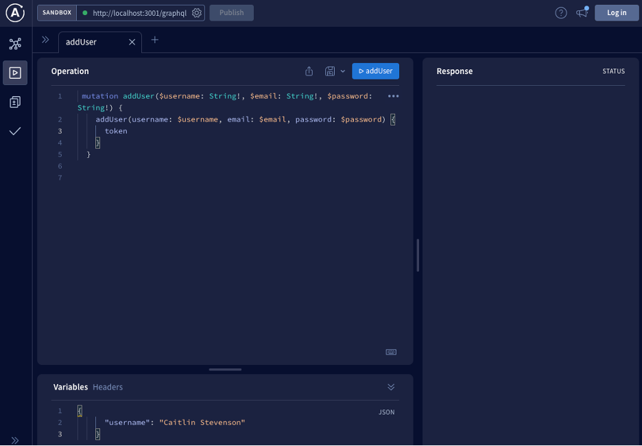

# Caitlin Stevenson|Book Search Engine Assignment

## Objectives

In this project, I modified key files within the provided Book Search Engine to transfer the application from a using RESTful APIs to GRAPHQL. Our instructor provided some additional code to support us in successfully transitioning the web application. While I was able to get the application to run locally through /graphql I was unable to deploy the application to Heroku using AtlasDB.

## Screenshot of GraphQL Page

## Link To The Deployed Page

[Link to final webpage](https://frozen-plains-51960.herokuapp.com/)

## Link To GitHub Repo

[Link to GitHub Repo](https://github.com/caitlinscodes/book_search_engine)

## License

This code is licensed under the MIT License.